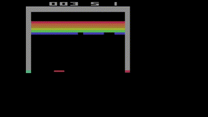

# Introduction to Reinforcement Learning

Course given by Erwan le Plennec during the M2 Data Science of the Insitut Polytechnique de Paris (2022-2023).

Paper Analysis of Rainbow: Combining Improvements in Deep Reinforcement Learning. We implemented the standard convolutional DQN and attempted several improvements used in the Rainbow Network. The agent was tested on the Atari Breakout game from the Gymnasium Library.



{\
url = {https://arxiv.org/abs/1710.02298}, \
author = {Hessel, Matteo and Modayil, Joseph and van Hasselt, Hado and Schaul, Tom and Ostrovski, Georg and Dabney, Will and Horgan, Dan and Piot, Bilal and Azar, Mohammad and Silver, David}, \
title = {Rainbow: Combining Improvements in Deep Reinforcement Learning}, \
year = {2017},\
copyright = {arXiv.org perpetual, non-exclusive license} \
}

## 1. Structure of the report

1. Background
   1. Markov Decision Process
   2. Monte-Carlo Methods and Q-Learning
   3. Deep Q-Learning
2. Selected Improvements
   1. Double DQN
   2. Prioritized Experience Replay
   3. Dueling Network
   4. Noisy DQN
   5. Learning from multi-step bootstrap targets in A3C
   6. Distributional Q-Learning
3. Rainbow: the combined Agent
4. Dataset
   1. The Atari Benchmark
   2. Gymnasium: A Practical Atari Environment
   3. Data Preprocessing
5. Rainbow Experiments
6. DQN-Rainbow Implementation
   1. DQN Architecture
   2. Rainbow Improvement
   3. Results and Difficulties

## 2. Installation

1. Clone the repository

```bash
git clone https://github.com/hugodebes/Introduction-to-Reinforcement-Learning
```

2. Install the project

- With `poetry` ([installation](https://python-poetry.org/docs/#installation)) :

```bash
poetry install
```
